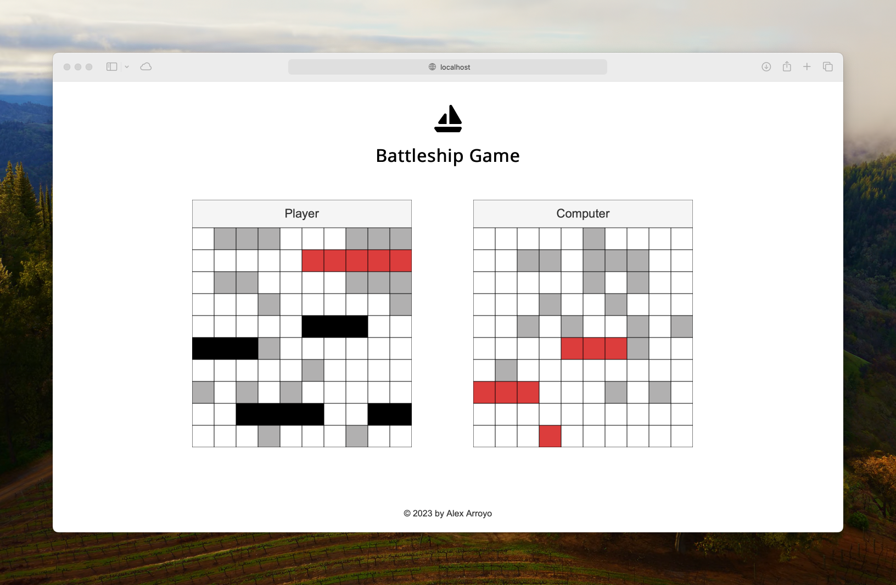

# Battleship Game

Battleship Game is a classic two-player strategy board game implemented as a web application. In this game, players take turns to guess the locations of their opponent's fleet of ships and attempt to sink them. The player who sinks all of their opponent's ships first wins the game.

This project includes both the game logic and a user interface for a simple and enjoyable Battleship experience. Below, you'll find information on how to get started with the game, the rules, and how to contribute to the project.

## Play the game

To play the game just go to https://alexaldearroyo.github.io/battleship/

1. Start the game by clicking the "START GAME" button on the main page.
2. Place your ships on the Player's grid by clicking on the cells.
3. Once all your ships are placed, the game will start automatically.
4. Click on cells in the Computer's grid to fire shots and try to sink their ships.
5. The game will continue until one player's fleet is completely sunk.
6. The winning player will be displayed in an alert message.

## Game Rules

### Objective

The objective of the Battleship Game is to sink all of your opponent's ships before they sink yours. Each player has a fleet of five different-sized ships: Carrier (5 cells), Battleship (4 cells), Destructor (3 cells), Submarine (3 cells), and Patrol Boat (2 cells).

### Game Setup

- The game board consists of two grids: one for each player - Player and Computer.
- Players take turns to guess the coordinates of their opponent's ships on the opponent's grid.
- The game starts with the Player placing their ships on their own grid. The Computer's ships are placed randomly.

### Gameplay

- Players take turns firing shots at their opponent's grid by selecting a cell on the grid.
- If a shot hits an enemy ship, it's marked as a "hit."
- If a shot misses all enemy ships, it's marked as a "miss."
- The first player to sink all of their opponent's ships wins the game.

### Ship Placement

- The Player can manually place their ships on their grid at the start of the game.
- Ships can be placed horizontally or vertically on the grid, as long as they fit within the boundaries and don't overlap.
- Use the "Change Direction" button to switch between horizontal and vertical placement.

### Winning the Game

- The game continues until one player sinks all of their opponent's ships.
- When all ships of a player are sunk, the opposing player is declared the winner.

## Copyright

© 2023-2024 Alex Arroyo